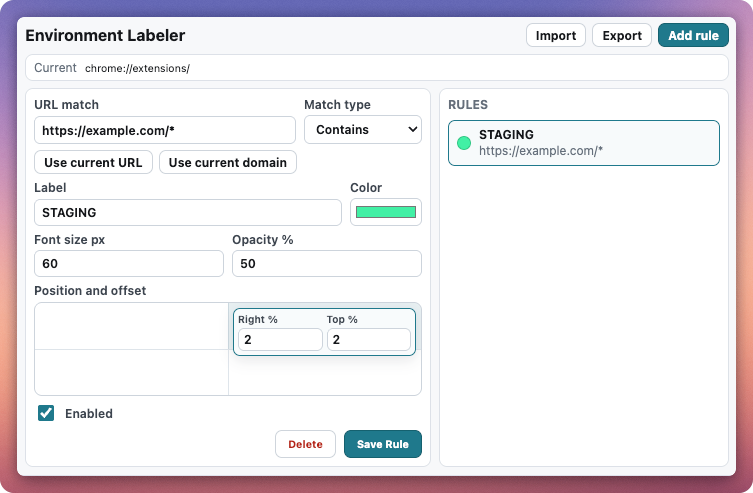

# Environment Labeler

Environment Labeler helps you see which environment you are currently using.

If your production, staging, test, or customer systems look similar, this extension can show a clear label such as `STAGING`, `PROD`, or `QA` directly on the page.



## What It Does

- Shows a custom text label on matching websites.
- Lets you choose the label text, color, size, opacity, and screen position.
- Supports multiple rules for different environments.
- Lets you import and export your rules as a backup.
- Stores your configuration in Chrome.

## Install Locally

1. Open `chrome://extensions` in Chrome.
2. Turn on **Developer mode**.
3. Click **Load unpacked**.
4. Select this extension folder.

## Build A Zip File

Run this command from the extension folder:

```sh
./build.sh
```

The zip file will be created in the `dist` folder.

## Add A Rule

1. Open a website you want to mark.
2. Click the extension icon.
3. Click **Add rule**.
4. Use **Use current URL** or **Use current domain**, or enter a URL manually.
5. Choose a match type.
6. Enter a label, for example `STAGING`.
7. Pick the color, size, opacity, position, and offset.
8. Click **Save Rule**.

The label appears when the current page matches the rule.

## Match Types

Use **Contains** for most cases. It matches when the page URL contains the text you entered.

Examples:

- `staging.example.com`
- `qa.example.com`
- `customer-a`

Use **Domain** when you want to match a whole domain and its subdomains.

Example:

- `example.com` matches `example.com`, `app.example.com`, and `staging.example.com`.

Use **Exact URL** when only one specific page should match.

Use **Wildcard** when you want to use `*` as a placeholder.

Example:

- `*://*.example.dev/*`

Use **Regex** only if you are comfortable with regular expressions.

## Import And Export

Use **Export** to download your rules as a JSON file.

Use **Import** to restore rules from a previously exported JSON file.

## Privacy

This extension does not send your rules or browsing data to any server.

Rules are stored in Chrome storage. If Chrome Sync is enabled in your browser profile, Chrome may sync those rules between your own devices.
